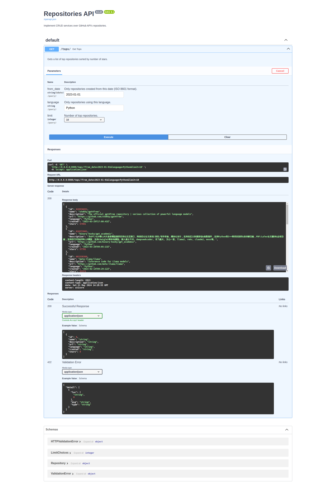

# Repositories API

## Overview

A simple FastAPI service built on top of the [GitHub API](https://docs.github.com/en/rest?apiVersion=2022-11-28) service that
returns the top repositories sorted by stars.

## Project Dependencies

These are some of the project's main dependencies. For a full list of dependencies refer to [pyproject.toml](./pyproject.toml).

Production:

- [fastapi](https://fastapi.tiangolo.com/): A back-end framework.
- [gidgethub](https://gidgethub.readthedocs.io/en/latest/): An async GitHub API client.
- [cachetools](https://cachetools.readthedocs.io/en/latest/): A caching module for the GitHub API client.
- [uvicorn](https://www.uvicorn.org/): An ASGI web server.

Development:

- [pytest](https://docs.pytest.org/en/8.2.x/): A test framework.
- [vcrpy](https://vcrpy.readthedocs.io/en/latest/): A mocker that records and mocks actual GitHub API requests.
- [honcho](https://honcho.readthedocs.io/en/latest/): An application manager.

## Development

### Create a Virtual Environment

For convenience, we will create a specific virtual environment for development:

```bash
python -m venv venv
source venv/bin/activate
```

### Install the Dependencies

```bash
poetry config virtualenvs.in-project true
poetry install
```

This will install the dependencies in our development virtual environment rather than globally.

### Run Tests

```bash
pytest -s -vvv
```

You should get results similar to these:

```
======================== test session starts ==========================================================================================
platform linux -- Python 3.10.13, pytest-8.2.0, pluggy-1.5.0 -- /home/marcio/Workspace/RedcarePharmacy/repositories-api/venv/bin/python
cachedir: .pytest_cache
rootdir: /home/marcio/Workspace/RedcarePharmacy/repositories-api
configfile: pyproject.toml
plugins: anyio-4.3.0, cov-5.0.0
collected 9 items                                                                                                                                                                                                                            

tests/test_app.py::test_get_tops_with_from_date PASSED
tests/test_app.py::test_get_tops_with_all_languages PASSED
tests/test_app.py::test_get_tops_with_specific_language PASSED
tests/test_app.py::test_get_tops_with_specific_limit_50 PASSED
tests/test_app.py::test_get_tops_with_specific_limit_100 PASSED
tests/test_app.py::test_get_tops_with_invalid_limits PASSED
tests/test_app.py::test_get_tops_with_invalid_from_date PASSED
tests/test_app.py::test_get_tops_with_rate_limit_exceeded PASSED
tests/test_app.py::test_get_tops_with_crud_exception PASSED

=========================================== 9 passed in 0.13s ===========================================================================
```

You may also use honcho:

```bash
honcho start tests
```

It's also possible to generate coverage reports:

```bash
pytest --cov=. --cov-report html
```

Once generated, they should be available inside `./htmlcov/`:


You may also use honcho:

```bash
honcho start coverage
```

### Run in Development Mode

This application requires a GitHub API access token. Once you obtain your token, export the following variable with your own:

```bash
export GITHUB_API_ACCESS_TOKEN="YOUR ACCESS TOKEN"
```

Now you can start the service in development mode:

```bash
honcho start runserver
```

The service should be available [here](http://127.0.0.1:8000/):



### Hints

This project uses honcho to manage tasks. The following tasks are available:

| Task                         | Purpose                                                                                      |
|:-----------------------------|:---------------------------------------------------------------------------------------------|
| `honcho start service`       | Used to start the service with ASGI server.                                                  |
| `honcho start runserver`     | Used to start the service in development mode.                                               |
| `honcho start tests`         | Run tests.                                                                                   |
| `honcho start format`        | Formats code and organize imports using black and isort.                                     |
| `honcho start format_check`  | Only checks formatting (meant to be used in CI).                                             |
| `honcho start pylint_check`  | PyLint checks.                                                                               |
| `honcho start mypy_check`    | MyPy checks.                                                                                 |
| `honcho start quality_check` | PyLint & MyPy checks.                                                                        |
| `honcho start coverage`      | Generate test coverage reports. Once generated, they should be available inside `./htmlcov/`.|

## Production

There's a [Dockerfile](./Dockerfile) ready for deployment. All that is needed is providing the proper
configuration through environment variables. This image could be pushed to an image registry and then deployed
to a Kubernetes cluster for instance.

You may also run the service using docker:

```
docker build -t repositories-api .
docker run -d -p 8888:8888 -e GITHUB_API_ACCESS_TOKEN="YOUR ACCESS TOKEN"... repositories-api
```

Note that you will need to configure the application through environment variables, in this case passing command-line arguments.